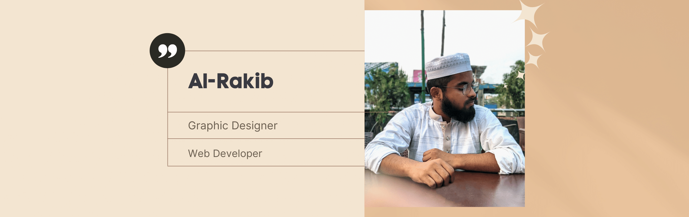

A passionate Graphics Designer and a practicing web developer who loves to create awesome (Self Assumed) stuffs.

```
Name:- Al-Rakib
Country:- Bangladesh
Age:- 20 years
```

<details>
 <summary>Social</summary>
 <a href="https://www.behance.net/alraakib" target="_blank">
      
</a>
<a href="https://github.com/alraakib" target="_blank">
      
</a>
<a href="https://www.facebook.com/alraakib" target="_blank">
      
</a>
<a href="https://www.instagram/alraakib" target="_blank">
      
</a>

That's all I use.

</details>

<details>
<summary>
Tools I Use 🔧
</summary>

I use quite a few tools, here are few of them. I add new and remove them frequently.

##### Graphics

 


##### Code Editor

 


##### Languages

 
 
 
 

And all the common web dev stuff.

##### Frameworks


 And a few more...

##### Databases


That's it.

</details>

---

Thanks for Reading
